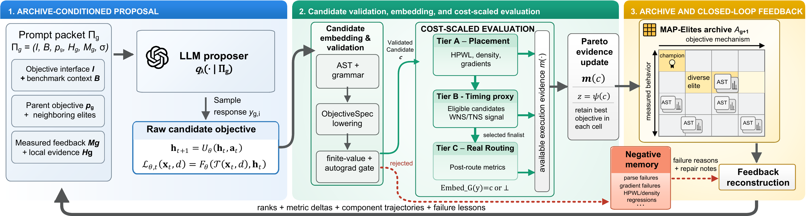

# CoEvoP&R Platform

This repository contains the source code and configurations for CoEvoP&R. It evolves readable differentiable placement objectives, embeds validated candidates in DREAMPlace, evaluates placement-stage timing evidence, and schedules selected placements for post-route evaluation with ChiPBench and OpenROAD.

[](Figures/Figure1.pdf)

## Artifact contents

- `coevop/objectives` implements the restricted `typed_policy_v1` objective interface.
- `coevop/evolution` implements MAP-Elites memory, islands, migration, and archive-conditioned proposal context.
- `coevop/eval/openevolve_tier2.py` implements objective evolution and cost-scaled evaluation.
- `patches/dreamplace` contains the DREAMPlace integration patch.
- `configs/openevolve_tier2/chipbench_controller_tier2.toml` is the primary paper configuration.
- `configs/timing_panels/chipbench_proxy_audit.toml` defines the four-design timing-evidence audit.
- `configs/timing_panels/chipbench_timing_controller.toml` supplies in-loop timing collateral for candidates with per-net weight policies.
- `coevop/eval/exposure.py` derives the CoEvoP&R-E and CoEvoP&R-L configurations from the primary configuration.
- `coevop/eval/fixed_dp_bo.py` implements the Fixed-DP schedule BO control.
- `configs/shared_panels/chipbench_table1_post_route.toml` defines the eight-design Nangate45 post-route panel.
- `configs/shared_panels/iccad2015_superblue_final_notiming.toml` defines the eight-design Superblue transfer panel.
- `configs/shared_panels/asap7_controller_final.toml` and `asap7_post_route.toml` define the gcd, ibex, and ariane ASAP7 panels.

Benchmark data, DREAMPlace, ChiPBench, OpenROAD, and OpenROAD-flow-scripts are external dependencies and are not redistributed.

## 1. Environment

The artifact is intended for Linux or WSL2 with Python 3.10 or newer. Set the backend roots before running any command.

```bash
export COEVOP_ROOT=/path/to/CoEvoP-R
export DREAMPLACE_ROOT=/path/to/DREAMPlace/install
export CHIPBENCH_ROOT=/path/to/ChiPBench
export OPENROAD_FLOW_ROOT=/path/to/OpenROAD-flow-scripts
export PYTHONPATH="$COEVOP_ROOT"
```

The expected backend entry points are

```text
$DREAMPLACE_ROOT/dreamplace/Placer.py
$DREAMPLACE_ROOT/dreamplace/PlaceObj.py
$DREAMPLACE_ROOT/bin/ot-shell
$CHIPBENCH_ROOT/benchmarking/benchmarking.py
$CHIPBENCH_ROOT/flow/designs/nangate45/
$OPENROAD_FLOW_ROOT/flow/platforms/asap7/
```

OpenROAD must be available on `PATH` or through the ChiPBench installation.

## 2. Install and test

```bash
cd "$COEVOP_ROOT"
python3 -m venv .venv
source .venv/bin/activate
python3 -m pip install --upgrade pip
python3 -m pip install -e '.[dev]'
python3 -m pytest -q
python3 -m coevop.cli env-check
```

## 3. DREAMPlace integration

For a fresh DREAMPlace 4.0 checkout, apply the complete source patch series before building.

```bash
python3 -m coevop.cli dreamplace-apply-source-patches \
  --source-root /path/to/DREAMPlace

cd /path/to/DREAMPlace
mkdir -p build
cd build
cmake .. \
  -DCMAKE_INSTALL_PREFIX=../install \
  -DPython_EXECUTABLE="$(command -v python3)"
make -j"$(nproc)"
make install
export DREAMPLACE_ROOT=/path/to/DREAMPlace/install
cd "$COEVOP_ROOT"
```

The source series contains the trajectory-aware objective runtime, OpenTimer interface updates, DREAMPlace 4.0 build compatibility, and mixed-size placement support. Check the installed runtime after building.

```bash
python3 -m coevop.cli dreamplace-status
```

The status must report `placeobj_patch_applied: true`. `dreamplace-apply-patch` can update the Python integration in an existing compatible installation. Timing-source changes require the source build above. Validate the typed objective path with the supplied controller panel.

```bash
python3 -m coevop.cli objective-preset \
  --name dreamplace_controller_native_identity \
  --output runs/objectives/controller_identity.json

python3 -m coevop.cli tier2-dreamplace \
  --panel configs/shared_panels/chipbench_controller_identity_smoke.toml \
  --objectives runs/objectives/controller_identity.json \
  --run-dir runs/controller_identity_smoke \
  --require-output-artifact
```

The run summary records finite scalar values, gradient availability, policy-state trajectories, component traces, and the output DEF.

The paper experiments used one NVIDIA RTX A6000 GPU with 48 GB memory and one Intel Xeon Gold 5218R CPU. Equivalent software behavior is expected on other supported CUDA systems, while runtime may vary.

## 4. ChiPBench and OpenROAD checks

Run the static dependency check when the Nangate45 data are installed.

```bash
python3 -m coevop.cli shared-panel-check \
  --panel configs/shared_panels/chipbench_table1_post_route.toml \
  --run-dir runs/backend_check \
  --skip-runs

```

The routed evaluator accepts a JSON placement manifest containing `design`, `objective_id`, `seed`, and `def_path`. A direct post-route invocation is

```bash
python3 -m coevop.cli tier3-openroad \
  --panel configs/shared_panels/chipbench_table1_post_route.toml \
  --placements runs/placements.json \
  --run-dir runs/post_route \
  --baseline-objective-id default \
  --resume
```

`comparison_table.csv` reports routed wirelength and congestion deltas together with post-route WNS and TNS gains relative to the matched native DREAMPlace placement.

## 5. Placement-stage timing evidence

Export the timing constraints from the same ChiPBench floorplan run used to
construct each placement benchmark. The audit panel uses bp_fe, swerv_wrapper,
ethernet, and or1200; candidates with a per-net weight policy need the
constraints of all eight designs.

```bash
export COEVOP_TIMING_COLLATERAL_ROOT="$COEVOP_ROOT/data/timing_collateral"
python3 scripts/export_table1_timing_collateral.py \
  --config-root configs/dreamplace_base/chipbench_movable \
  --output-root "$COEVOP_TIMING_COLLATERAL_ROOT"
```

Evaluate a placement manifest and audit timing redundancy.

```bash
python3 -m coevop.cli timing-proxy-eval \
  --panel configs/timing_panels/chipbench_proxy_audit.toml \
  --placements runs/placements.json \
  --run-dir runs/timing_proxy

python3 -m coevop.cli timing-proxy-audit \
  --design bp_fe \
  --base-config configs/dreamplace_base/chipbench_movable/bp_fe.json \
  --timing-panel configs/timing_panels/chipbench_proxy_audit.toml \
  --placements runs/placements.json \
  --run-dir runs/timing_proxy/audit_bp_fe
```

The audit perturbs placed coordinates by 100 to 2000 DBU and correlates the resulting WNS and TNS movement with HPWL movement. For each design and each metric the outcome is Admit when the larger of the absolute Pearson and Spearman correlations is below 0.70, Tie up to 0.95, and Reject above it. Admit lets the metric enter candidate selection, Tie uses it only to order candidates on the same Pareto front, and Reject excludes it. During evolution the audit runs on the seed placements and again every 20 generations, on the native placement and the current best candidate; a metric whose movement disagrees with the post-route movement of the routed candidates is limited to Tie. The current outcome is stored in `timing_proxy_audit/admission.json`.

Only cells satisfying the configured net-coverage and stability checks are admitted as timing evidence.
For every evaluated placement, CoEvoP&R reconstructs a flat named-port
timing netlist directly from its DEF. The runtime manifest records the source
DEF, component count, net count, port count, and connected pin count. This
keeps DREAMPlace placement names and OpenTimer timing names aligned without
depending on tool-specific net renaming in an exported Verilog file.

## 6. Objective evolution

Set the model and API credential used in the paper.

```bash
export OPENAI_API_KEY=YOUR_KEY
export OPENAI_MODEL=gpt-5.4
```

The `provider` key of the evolution configuration selects the proposal model. `openai` is the default; `qwen` reads `QWEN_API_KEY` and `QWEN_MODEL`. `anthropic` uses the Anthropic SDK, which resolves its own credentials, and reads `ANTHROPIC_MODEL` (default `claude-opus-4-8`).

```bash
python3 -m pip install -e '.[anthropic]'
```

Inspect the first archive-conditioned prompt without making an API call.

```bash
python3 -m coevop.cli openevolve-prompt-dry-run \
  --config configs/openevolve_tier2/chipbench_controller_tier2.toml \
  --output-dir runs/prompt_dry_run
```

Launch or resume the paper configuration.

```bash
python3 -m coevop.cli openevolve-tier2 \
  --config configs/openevolve_tier2/chipbench_controller_tier2.toml \
  --platform-config configs/default.toml \
  --run-dir runs/chipbench_controller \
  --resume
```

The configuration evaluates three proposals per generation for 160 generations on five islands. Each candidate receives cost-scaled evidence.

- Tier A runs DREAMPlace for every validated candidate.
- Tier B applies the timing proxy to the candidates whose Tier A placement completed with finite HPWL and overflow.
- Tier C routes three candidates every 20 generations. Their routed wirelength, routing overflow, WNS, and TNS update the program records and `routed_feedback.json`, which keeps every routed round, before the next prompt is constructed.

The archive orders candidates by Pareto dominance over wirelength, overflow, WNS, and TNS. Each coordinate is compared at the most faithful tier both candidates received, so routed measurements are compared only with routed measurements. Every 20 generations all islands exchange elites along the ring, and the archive is Pareto-refreshed afterwards.

A candidate may define `update_net_weights`. It then runs timing-driven with the collateral in `configs/timing_panels/chipbench_timing_controller.toml`, and its placed DEF is written back with the original identifiers. Remove the `panel` line under `[timing_controller]` to keep per-net policies out of the search.

### Exposure settings

The primary configuration evolves one objective with feedback from all eight ChiPBench designs. Its champion, `frozen_nangate45_champion.json`, is the candidate transferred without further search as CoEvoP&R-T.

CoEvoP&R-E uses feedback from the same design on which it is evaluated. Create that configuration for one target design with

```bash
python3 scripts/make_target_evolution_config.py \
  --family chipbench \
  --design bp_fe \
  --output-dir runs/configs/target_bp_fe

python3 -m coevop.cli openevolve-tier2 \
  --config runs/configs/target_bp_fe/openevolve.toml \
  --platform-config configs/default.toml \
  --run-dir runs/target_bp_fe \
  --resume
```

The script accepts `--family chipbench`, `superblue`, or `asap7`. Every generated configuration is derived from the primary configuration and keeps its method and budget; only the feedback panel and the collateral that exists for the target change. Tier B is enabled when the target design is in the timing panel.

CoEvoP&R-L excludes the target design from objective evolution and prompt evidence. Create a leave-one-design-out configuration with

```bash
python3 scripts/make_chipbench_lodo_config.py \
  --heldout mor1kx \
  --output-dir runs/configs/lodo_mor1kx

python3 -m coevop.cli openevolve-tier2 \
  --config runs/configs/lodo_mor1kx/openevolve.toml \
  --platform-config configs/default.toml \
  --run-dir runs/lodo_mor1kx \
  --resume
```

The held-out circuit is absent from the search panel, prompt context, parent selection, and scheduled search feedback. It enters the flow only through the final generalization and post-route evaluation. The configuration is otherwise identical to the primary configuration.

## 7. Paper result aggregation

Aggregate a method directly from the post-route comparison table.

```bash
python3 scripts/aggregate_post_route_results.py \
  --comparison-csv runs/post_route/comparison_table.csv \
  --objective-id OBJECTIVE_ID \
  --expected-seeds 3 \
  --output runs/post_route/OBJECTIVE_ID_summary.json
```

The aggregator reports routed wirelength reduction, congestion reduction, WNS gain, and TNS gain. A design is included only when all three matched seeds complete successfully.

## 8. Superblue and ASAP7 transfer

Create the CoEvoP&R-E configuration for a Superblue design with

```bash
export SUPERBLUE_OPENROAD_CONFIG_ROOT=/path/to/superblue/openroad/configs
python3 scripts/make_target_evolution_config.py \
  --family superblue \
  --design 3 \
  --output-dir runs/configs/superblue3

python3 -m coevop.cli openevolve-tier2 \
  --config runs/configs/superblue3/openevolve.toml \
  --platform-config configs/default.toml \
  --run-dir runs/superblue3 \
  --resume
```

Repeat with designs 1, 4, 5, 7, 10, 16, and 18 for the complete target-evolution panel, and with `--family asap7 --design gcd`, `ibex`, and `ariane` for ASAP7. These families ship no placement-stage timing collateral, so their candidates carry Tier A and Tier C evidence. The frozen Nangate45 champion can also be evaluated with the supplied Superblue and ASAP7 placement panels through `tier2-dreamplace`. The resulting DEF manifest is passed to `tier3-openroad` with `superblue_post_route.toml` or `asap7_post_route.toml`.

ASAP7 requires gcd, ibex, and ariane collateral under `flow/designs/asap7` and the ASAP7 platform under `OPENROAD_FLOW_ROOT`.

Run the ASAP7 dependency check before transfer evaluation.

```bash
python3 -m coevop.cli asap7-panel-check \
  --platform-config configs/default.toml \
  --dreamplace-config-dir configs/dreamplace_base/asap7 \
  --run-dir runs/asap7_check

python3 -m coevop.cli asap7-transfer \
  --platform-config configs/default.toml \
  --dreamplace-config-dir configs/dreamplace_base/asap7 \
  --source-objective runs/chipbench_controller/frozen_nangate45_champion.json \
  --run-dir runs/asap7_transfer \
  --resume
```

## 9. Fixed-DP schedule BO

This control keeps the DREAMPlace objective form, smoothed wirelength plus a scheduled density weight, and tunes only the coefficients of the density and smoothing schedules with a tree-structured Parzen estimator. It reads the same evolution configuration and therefore uses the same panels, generations, proposals per generation, evidence tiers, and scheduled routed evaluations. The estimator is fit to the archive's Pareto evidence order, so routed evidence guides it as it guides objective evolution.

```bash
python3 -m pip install -e '.[baselines]'
python3 -m coevop.cli fixed-dp-schedule-bo \
  --config configs/openevolve_tier2/chipbench_controller_tier2.toml \
  --platform-config configs/default.toml \
  --run-dir runs/fixed_dp_schedule_bo \
  --resume
```

`summary.json` reports the proposal, valid, archive, and routed counts together with the best schedule and its evidence.

## Output provenance

Each run stores the resolved configuration, objective program, prompt and response records, candidate metrics, component and state traces, placement artifacts, routed metrics, and failure records under its run directory. These files are sufficient to reconstruct candidate lineage and the evidence used by the archive.

## Citation

If you use CoEvoP&R in your research, please cite the [arXiv paper](https://arxiv.org/abs/2607.17398):

```bibtex
@misc{chen2026coevop,
  title         = {CoEvoP\&R: Co-Evolving Placement Objectives with Routing Feedback via Large Language Models},
  author        = {Ruogu Chen and Weihua Xiao and Ramesh Karri and Jie Han},
  year          = {2026},
  eprint        = {2607.17398},
  archivePrefix = {arXiv},
  primaryClass  = {cs.LG},
  doi           = {10.48550/arXiv.2607.17398},
  url           = {https://arxiv.org/abs/2607.17398}
}
```
